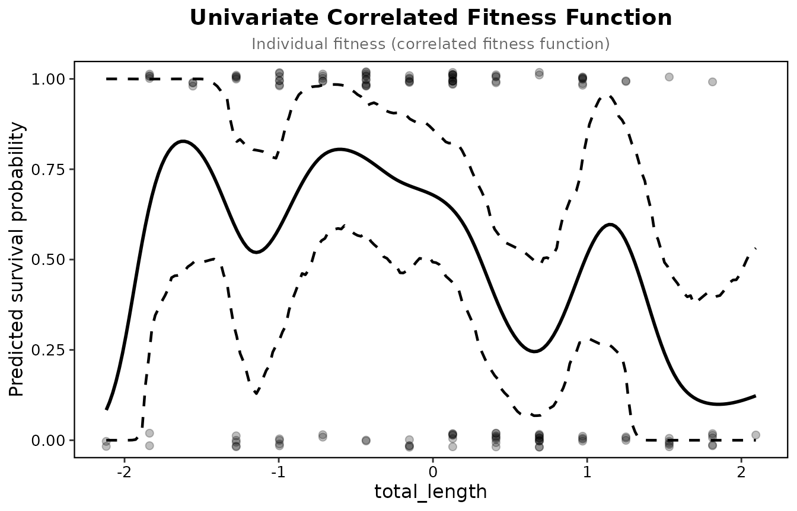

# Bumpus's sparrows

Bumpus (1899) measured 136 house sparrows brought in after a winter
storm in Providence, Rhode Island, of which 72 survived. The data ship
with the package as `bumpus`, with nine traits. Janzen and Stern (1998)
reanalysed them by sex with logistic regression, and their tables are
the reference the package is checked against.

## Gradients on all nine traits

``` r

library(lande)
traits <- c("total_length", "wingspread", "weight", "head_length", "humerus",
            "femur", "tibiotarsus", "skull_width", "sternum")
report <- selection_report(bumpus, "survival", traits, fitness_type = "binary")
report[report$Type == "Linear", ]
```

    ## Selection analysis (standardised traits, relative fitness)
    ## Fitness type: binary 
    ## p-values are from a logistic model on the same terms
    ## 
    ##          Term   Type Estimate Std_Error P_Value Sig
    ##  total_length Linear  -0.4931    0.1067  0.0000 ***
    ##    wingspread Linear   0.2478    0.1257  0.0563   .
    ##        weight Linear  -0.3842    0.0975  0.0004 ***
    ##   head_length Linear   0.0830    0.1002  0.2484    
    ##       humerus Linear   0.2655    0.1566  0.0748   .
    ##         femur Linear  -0.0390    0.1510  0.7613    
    ##   tibiotarsus Linear   0.0048    0.1258  0.9386    
    ##   skull_width Linear   0.0683    0.0890  0.5947    
    ##       sternum Linear   0.2323    0.0924  0.0184   *
    ## 
    ## Signif: *** 0.001  ** 0.01  * 0.05  . 0.1

Survival selected against total length and weight and for sternum
length, with the other traits held constant. The p-values come from the
logistic model; the coefficients and their standard errors from least
squares on relative fitness, so they are on the Lande and Arnold scale.

## Within each sex

Janzen and Stern also standardised within sex and estimated each sex
separately, on log-transformed traits. On logged traits the package
gives their gradients to three decimals; on the raw traits used here the
numbers differ a little.

``` r

by_sex <- selection_coefficients(bumpus, "survival", traits, fitness_type = "binary",
                                 group = "sex", return_grouped = TRUE)
by_sex[by_sex$Type == "Linear" & by_sex$Term %in% c("total_length", "weight"), ]
```

    ##                  Term   Type Beta_Coefficient Standard_Error      P_Value
    ## male.1   total_length Linear       -0.5147084     0.09992533 0.0001120757
    ## male.3         weight Linear       -0.2710191     0.09309495 0.0097296235
    ## female.1 total_length Linear       -0.2144288     0.28448789 0.4185816892
    ## female.3       weight Linear       -0.5367989     0.25396615 0.0341716591
    ##             Variance  Group
    ## male.1   0.009985072   male
    ## male.3   0.008666669   male
    ## female.1 0.080933361 female
    ## female.3 0.064498805 female

Males (87 birds) carry the selection against total length; females (49)
the selection against weight, with wide standard errors.

## The fitness function for total length

``` r

prep <- prepare_selection_data(bumpus, "survival", "total_length")
fit <- univariate_spline(prep, "survival", "total_length", k = 6, bootstrap = TRUE, n_boot = 200)
plot_univariate_fitness(fit, "total_length")
```



With the default basis size, k = 10, the UBRE criterion settles on a
wiggly curve (edf 8.1) for these 136 birds; k = 6, or REML with k from 4
to 10, gives a smooth one (edf 2.2 to 2.5). Survival is highest a little
below average length and falls for longer birds. The band is a
percentile bootstrap of the spline.

## Checks

``` r

check_selection_assumptions(bumpus, "survival", c("total_length", "weight", "humerus"))
```

    ## Assumption checks (binary fitness, n = 136)
    ## 
    ##  check                                    statistic p    
    ##  Multivariate normality: Mardia skewness  1.05      0.006
    ##  Multivariate normality: Mardia kurtosis    15      0.997
    ##  Normality of total_length (Shapiro-Wilk) 0.978     0.029
    ##  Normality of weight (Shapiro-Wilk)       0.97      0.004
    ##  Normality of humerus (Shapiro-Wilk)      0.98      0.048
    ##  Collinearity: largest VIF                1.75           
    ##  Rarer outcome per quadratic term         7.11           
    ##  Logistic model: separation               1.34           
    ##  Model fit: R2_Tjur (performance)         0.24           
    ##  note                                                      
    ##  skewed                                                    
    ##  no evidence against normality                             
    ##  not normal                                                
    ##  not normal                                                
    ##  not normal                                                
    ##  below 5                                                   
    ##  64 of the rarer outcome for 9 terms; treat gamma with care
    ##  no sign of separation                                     
    ## 

With nine traits the quadratic model has 54 terms for 64 deaths, so only
the linear gradients in the report above are worth reading.
