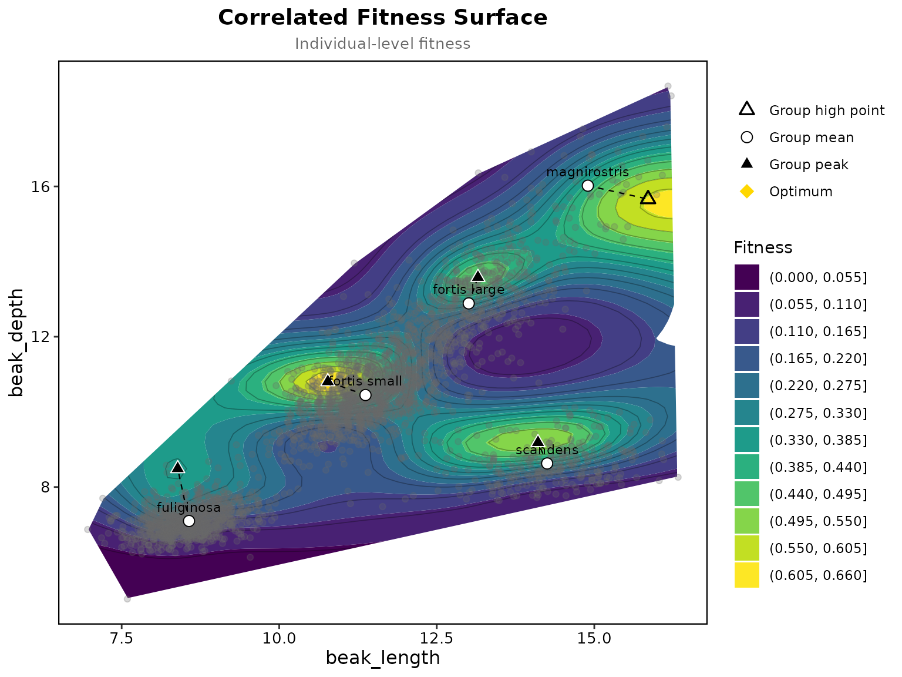

# Five finch groups on one surface

Beausoleil et al. (2023) fitted one fitness surface to 3428 ground
finches at El Garrapatero on Santa Cruz: four species, with *Geospiza
fortis* split into its small and large beak morphs, five groups in all.
Fitness was the number of later years a bird was seen again, traits were
beak length and depth in millimetres. The package has the data as
`finch_community`, built from their archive (<doi:10.5683/SP3/0YIWSE>).

``` r

library(Lande)
finches <- finch_community
table(finches$species)
```

    ## 
    ## fortis large fortis small   fuliginosa magnirostris     scandens 
    ##          586         1384         1096           53          309

## One pooled surface, the groups marked

The traits stay in millimetres, the fitness type is detected as a count
so the surface takes a Poisson family, cells farther than 0.15 of the
axis range from any bird are blanked as in the paper, and the group is
used only to mark each group’s mean and the highest point of the surface
within its own range.

``` r

surface <- correlated_fitness_surface(finches, "recaptures", c("beak_length", "beak_depth"),
                                      k = 27, too_far = 0.15,
                                      group = "species", group_effect = FALSE)
plot_correlated_fitness(surface, c("beak_length", "beak_depth"), show_points = TRUE, point_alpha = 0.25)
```



``` r

surface$groups
```

    ##          group    n mean_beak_length mean_beak_depth peak_beak_length
    ## 1 fortis large  586        13.007307       12.886966        13.153729
    ## 2 fortis small 1384        11.369052       10.448229        10.771525
    ## 3   fuliginosa 1096         8.568677        7.095934         8.389322
    ## 4 magnirostris   53        14.897689       16.019465        15.853559
    ## 5     scandens  309        14.251929        8.627551        14.106610
    ##   peak_beak_depth  peak_fit peak_interior peak_edge
    ## 1       13.580169 0.4984825          TRUE     FALSE
    ## 2       10.803898 0.6535953          TRUE     FALSE
    ## 3        8.490339 0.3524929          TRUE     FALSE
    ## 4       15.662373 0.6095700         FALSE     FALSE
    ## 5        9.184407 0.5441535          TRUE     FALSE

Each group’s mean lies within about a millimetre of the highest fitted
recapture rate in its range, 0.90 mm on average, which is the figure
Beausoleil et al. report. The flags say whether that high point is a
peak: four groups sit by a peak of their own, and for magnirostris the
surface keeps rising past its 53 birds towards the edge of the data.
Every maximum of the surface is listed in the result.

``` r

surface$peaks
```

    ##   beak_length beak_depth       fit interior
    ## 1   10.771525  10.803898 0.6535953     TRUE
    ## 2   16.171186  15.662373 0.6230330    FALSE
    ## 3   14.106610   9.184407 0.5441535     TRUE
    ## 4   13.153729  13.580169 0.4984825     TRUE
    ## 5    8.389322   8.490339 0.3524929     TRUE

## The same surface on standardised traits

The usual route in the package standardises the traits first. The peaks
come back in millimetres by undoing the scaling.

``` r

prep <- prepare_selection_data(finches, "recaptures", c("beak_length", "beak_depth"))
surface_z <- correlated_fitness_surface(prep, "recaptures", c("beak_length", "beak_depth"),
                                        k = 27, too_far = 0.15, group = "species", group_effect = FALSE)
g <- surface_z$groups
sds <- sapply(finches[, c("beak_length", "beak_depth")], sd)
mus <- colMeans(finches[, c("beak_length", "beak_depth")])
g$peak_length_mm <- g$peak_beak_length * sds[1] + mus[1]
g$peak_depth_mm <- g$peak_beak_depth * sds[2] + mus[2]
g[, c("group", "n", "peak_length_mm", "peak_depth_mm")]
```

    ##          group    n peak_length_mm peak_depth_mm
    ## 1 fortis large  586      13.153729     13.580169
    ## 2 fortis small 1384      10.771525     10.803898
    ## 3   fuliginosa 1096       8.389322      8.490339
    ## 4 magnirostris   53      15.853559     15.662373
    ## 5     scandens  309      14.265424      9.415763
