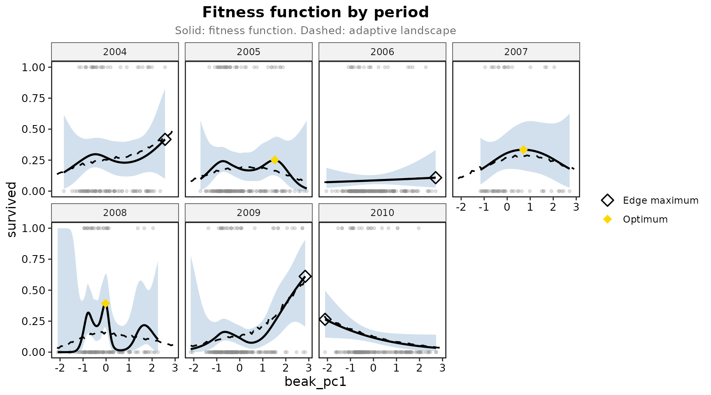
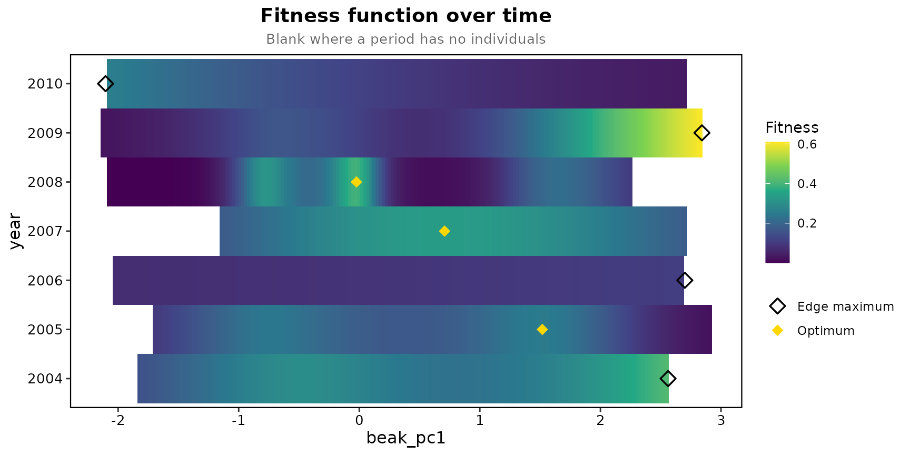

# Finches year by year

Beausoleil et al. (2019) followed medium ground finches at El
Garrapatero from 2004 to 2010 and fitted a separate fitness function to
each year. The package has them as `finch_yearly`, one row per bird per
year it was seen, with survival to the next year and beak size as the
first principal component of three beak measures.

``` r

library(Lande)
finch <- finch_yearly
table(finch$year)
```

    ## 
    ## 2004 2005 2006 2007 2008 2009 2010 
    ##  110  185  233   61  127  196  175

## One fitness function per year

Traits are standardised once, over all years, so the panels share one
axis.

``` r

prep <- prepare_selection_data(finch, "survived", "beak_pc1")
years <- temporal_landscape(prep, "survived", "beak_pc1", "year", simulation_n = 200)
years$summary[, c("time", "n", "mean_fitness", "edf", "optimum_beak_pc1", "peaks")]
```

    ##   time   n mean_fitness      edf optimum_beak_pc1 peaks
    ## 1 2004 110   0.27272727 2.514761       2.56126184     1
    ## 2 2005 185   0.20540541 3.891967       1.51821556     2
    ## 3 2006 233   0.08583691 1.000098       2.70000995     0
    ## 4 2007  61   0.26229508 1.672904       0.70740350     1
    ## 5 2008 127   0.20472441 6.385272      -0.02345104     3
    ## 6 2009 196   0.15306122 4.007243       2.84197912     1
    ## 7 2010 175   0.12000000 1.000048      -2.10396884     0

``` r

plot_temporal_landscape(years, ncol = 4)
```



Survival rose steeply with beak size in 2009, the year in which
Beausoleil et al. found the strongest selection; the 2006 and 2010
curves are straight lines with one degree of freedom; 2005 and 2008 have
more than one peak. The band is the 95% interval of each year’s spline,
the dashed line the adaptive landscape, and the diamond the highest
fitted survival in the year’s range, which for 2006, 2009 and 2010 sits
at the edge of the data rather than at an interior peak.

## As a heat map

``` r

plot_temporal_landscape(years, type = "heatmap")
```



The number of peaks in a fitted curve moves with the basis size, so the
`peaks` column describes the fit rather than testing anything.
