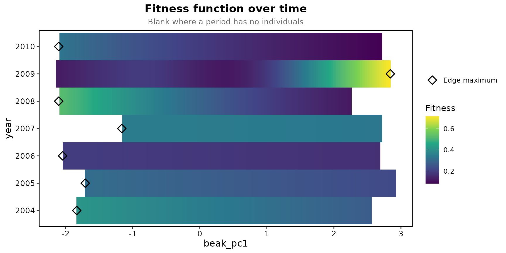

# Finches year by year

Beausoleil et al. (2019) followed medium ground finches at El
Garrapatero and fitted a separate fitness function to each year. The
package has the birds seen from 2004 to 2010 as `finch_yearly`, one row
per bird per year it was seen, with beak size as the first principal
component of three beak measures. A bird counts as surviving if it was
seen again in any later year up to 2018, the last year in the file.
Survival here is apparent survival; death cannot be told from
emigration.

``` r

library(lande)
finch <- finch_yearly
table(finch$year)
```

    ## 
    ## 2004 2005 2006 2007 2008 2009 2010 
    ##  110  185  233   61  127  196  175

## One fitness function per year

Traits are standardised once, over all years, so the panels share one
axis. The splines use REML, which is less prone than the default UBRE to
settle on a wiggly curve.

``` r

prep <- prepare_selection_data(finch, "survived", "beak_pc1")
years <- temporal_landscape(prep, "survived", "beak_pc1", "year", smoothing = "REML", simulation_n = 200)
years$summary[, c("time", "n", "mean_fitness", "edf", "optimum_beak_pc1", "peaks")]
```

    ##   time   n mean_fitness      edf optimum_beak_pc1 peaks
    ## 1 2004 110    0.3454545 1.000082        -1.834495     0
    ## 2 2005 185    0.2756757 1.000645        -1.708023     0
    ## 3 2006 233    0.1802575 1.000176        -2.045747     0
    ## 4 2007  61    0.3442623 1.016109        -1.162755     0
    ## 5 2008 127    0.3070866 1.000084        -2.103969     0
    ## 6 2009 196    0.1938776 3.165374         2.841979     1
    ## 7 2010 175    0.1885714 1.000047        -2.103969     0

``` r

plot_temporal_landscape(years, ncol = 4)
```


Most years are close to straight lines on the logit scale, usually
sloping gently down towards large beaks, most steeply in 2008 and 2010.
The exception is 2009, when survival dips past a small bump for the
small morph and then rises steeply towards large beaks; Beausoleil et
al. found their deepest valley in the 2009 to 2010 interval. The band is
the 95% interval of each year’s spline, the dashed line the adaptive
landscape, and the marker the highest fitted survival in the year’s
range, open where it sits at the edge of the data.

## How much the peaks depend on the smoothing

``` r

ubre <- temporal_landscape(prep, "survived", "beak_pc1", "year", simulation_n = 200)
data.frame(year = years$summary$time, REML = years$summary$peaks, UBRE = ubre$summary$peaks)
```

    ##   year REML UBRE
    ## 1 2004    0    1
    ## 2 2005    0    3
    ## 3 2006    0    2
    ## 4 2007    0    1
    ## 5 2008    0    3
    ## 6 2009    1    1
    ## 7 2010    0    0

With the default UBRE criterion several years have two or three peaks,
closer to the two peaks a year that Beausoleil et al. describe with a
smoothing parameter they fixed themselves. The count moves with the
smoothing and the basis size, so the `peaks` column is not a test;
theirs was the quadratic gradient on the birds between the peaks.

## As a heat map

``` r

plot_temporal_landscape(years, type = "heatmap")
```


