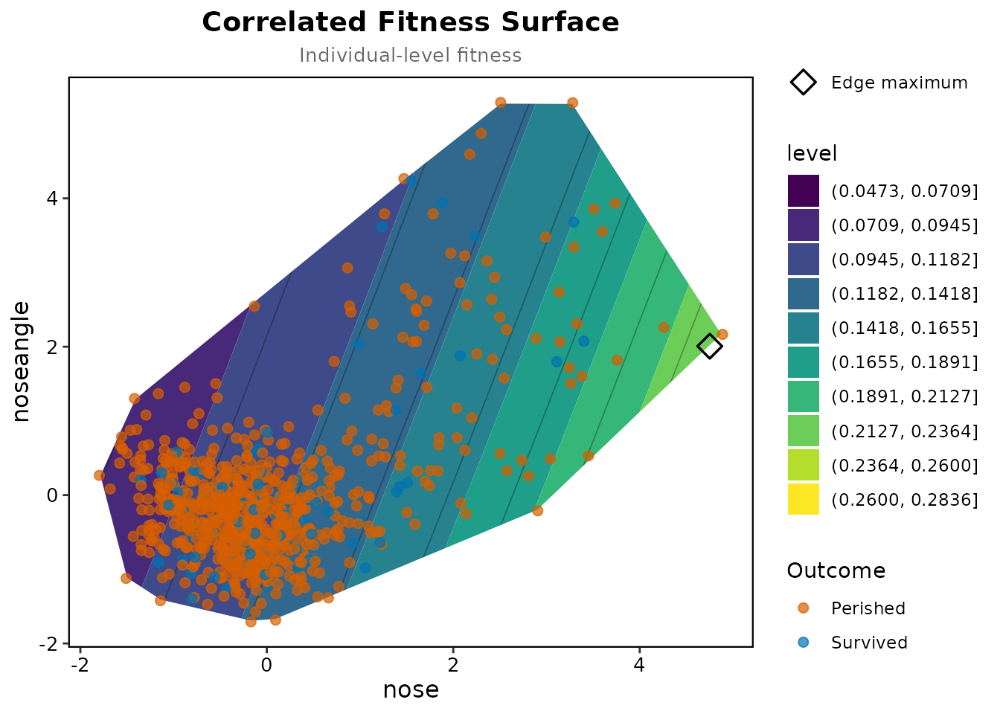
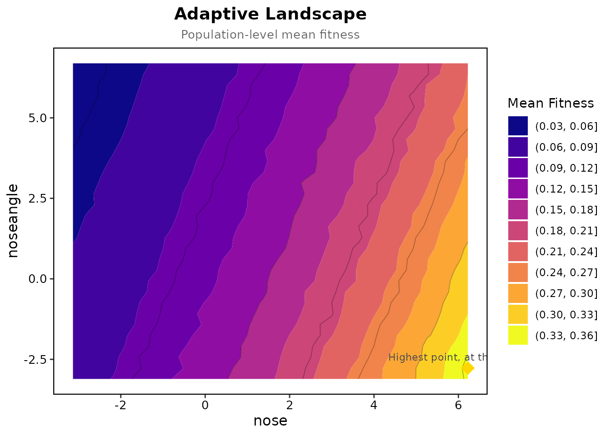

# Pupfish in two lakes

Martin (2016) released laboratory-reared hybrids of the three
*Cyprinodon* pupfish species of San Salvador Island into field
enclosures in two lakes and recorded survival over three months; Martin
and Wainwright (2013) describe the experiment. The package has the
survival data and trait scores for each lake as `crescent_pond_pupfish`
and `little_lake_pupfish`, already standardised within lake;
[`?crescent_pond_pupfish`](https://human-augment-analytics.github.io/lande/reference/crescent_pond_pupfish.md)
describes the columns. They also hold the low-density enclosures and
laboratory-reared fish of the three parental species, but Martin’s
analyses use the high-density enclosures only, 796 fish in Crescent Pond
and 875 in Little Lake, so we keep to those. The traits are the six
functional traits of Martin’s Table 3: lower jaw length (`jaw`), upper
jaw length (`pmx`), nasal protrusion (`nose`), nasal angle
(`noseangle`), body depth (`body`) and orbit diameter (`eye`).

``` r

library(lande)
crescent <- crescent_pond_pupfish[crescent_pond_pupfish$density == "H", ]
little <- little_lake_pupfish[little_lake_pupfish$density == "H", ]
traits <- c("jaw", "pmx", "nose", "noseangle", "body", "eye")
c(crescent = nrow(crescent), little = nrow(little))
```

    ## crescent   little 
    ##      796      875

## Gradients in each lake

``` r

cp <- selection_report(crescent, "survival", traits, fitness_type = "binary")
cp[cp$Type == "Linear", ]
```

    ## Selection analysis (standardised traits, relative fitness)
    ## Fitness type: binary 
    ## p-values are from a logistic model on the same terms
    ## 
    ##       Term   Type Estimate Std_Error P_Value Sig
    ##        jaw Linear  -0.1086    0.1895  0.5595    
    ##        pmx Linear   0.4895    0.2074  0.0180   *
    ##       nose Linear   0.3580    0.1359  0.0082  **
    ##  noseangle Linear  -0.0727    0.1214  0.5227    
    ##       body Linear   0.2676    0.1485  0.0615   .
    ##        eye Linear  -0.1245    0.1326  0.3670    
    ## 
    ## Signif: *** 0.001  ** 0.01  * 0.05  . 0.1

In Crescent Pond survival rose with upper jaw length and nasal
protrusion.

``` r

ll <- selection_report(little, "survival", traits, fitness_type = "binary")
ll[ll$Type == "Linear", ]
```

    ## Selection analysis (standardised traits, relative fitness)
    ## Fitness type: binary 
    ## p-values are from a logistic model on the same terms
    ## 
    ##       Term   Type Estimate Std_Error P_Value Sig
    ##        jaw Linear   0.0400    0.1185  0.7245    
    ##        pmx Linear   0.2025    0.1603  0.2032    
    ##       nose Linear   0.0343    0.1287  0.7986    
    ##  noseangle Linear   0.0842    0.1372  0.5785    
    ##       body Linear   0.4279    0.1267  0.0008 ***
    ##        eye Linear   0.1306    0.1083  0.1998    
    ## 
    ## Signif: *** 0.001  ** 0.01  * 0.05  . 0.1

In Little Lake survival rose with body depth and nothing else stands
out.

## The nasal traits in Crescent Pond

Nasal protrusion and nasal angle are one of Martin’s functional modules.

``` r

nasal <- c("nose", "noseangle")
prep <- prepare_selection_data(crescent, "survival", nasal)
surface <- correlated_fitness_surface(prep, "survival", nasal, grid_n = 50)
plot_correlated_fitness_enhanced(surface, nasal, original_data = prep, fitness_col = "survival")
```



The surface is drawn only within the convex hull of the fish; the
highest fitted survival sits at the edge of the data, among the fish
with the largest nasal protrusion.

``` r

land <- adaptive_landscape(prep, surface$model, nasal, grid_n = 30, simulation_n = 200)
plot_adaptive_landscape(land, nasal)
```



``` r

land$optimum_edge
```

    ## [1] TRUE

The highest mean fitness is on the edge of the grid, at the largest
nasal protrusion and outside the data, so within the data the landscape
has no peak.

## Curvature against Martin’s Table 3

Martin fitted a spline to each trait and reported how curved it was (his
Table 3): in Crescent Pond body depth most of all and upper jaw length
less, and every trait in Little Lake close to straight. Here are the
effective degrees of freedom of the univariate spline for each trait,
with the default smoothing, which for survival is UBRE (mgcv’s
`"GCV.Cp"` with a known scale), and with REML.

``` r

edf <- function(d, trait, smoothing) {
  prep <- prepare_selection_data(d, "survival", trait)
  summary(univariate_spline(prep, "survival", trait, smoothing = smoothing)$model)$edf
}
round(rbind(
  crescent_ubre = sapply(traits, edf, d = crescent, smoothing = "GCV.Cp"),
  crescent_reml = sapply(traits, edf, d = crescent, smoothing = "REML"),
  little_ubre = sapply(traits, edf, d = little, smoothing = "GCV.Cp"),
  little_reml = sapply(traits, edf, d = little, smoothing = "REML")
), 2)
```

    ##                jaw  pmx nose noseangle body  eye
    ## crescent_ubre 1.83 3.88 1.81      6.18 4.14 1.76
    ## crescent_reml 2.03 3.39 2.00      1.02 1.00 1.95
    ## little_ubre   1.64 6.85 1.00      7.44 1.52 1.00
    ## little_reml   1.80 1.00 1.00      1.00 1.67 1.00

Neither criterion matches his table exactly. UBRE comes close for most
traits and curves body depth in Crescent Pond, though less than he
found, but it also makes nasal angle in both lakes and upper jaw length
in Little Lake wiggly where his splines are straight. Counting an edf of
about 2 or less as close to straight, REML matches him for every trait
but body depth in Crescent Pond, which it leaves straight.
