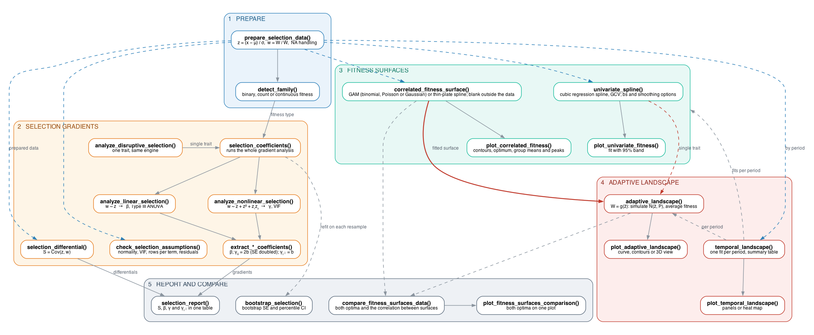

```{r setup, include = FALSE}
knitr::opts_chunk$set(
  eval = TRUE, echo = TRUE, message = FALSE, warning = FALSE,
  collapse = TRUE, comment = "#>",
  fig.width = 6.5, fig.height = 4.5, dpi = 72, out.width = "100%"
)
set.seed(1)
library(RforEvolution)
```

<style>
@media print {
  pre, .sourceCode { page-break-inside: auto; }
  img, .html-widget { page-break-inside: avoid; }
  h1, h2, h3 { page-break-after: avoid; }
}
</style>

# Evolutionary Selection Analysis Framework

## 1. Overview

This package measures natural selection on phenotypic traits the way Lande & Arnold (1983) set out, and adds spline fitness functions, fitness surfaces and adaptive landscapes on top of the same prepared data. Svensson (2023) reviews the approach and the arguments about it; Palacio et al. (2019) set out what an analysis should report, and `check_selection_assumptions()` runs the checks they ask for on the data and the models.

**Key capabilities:**

| Analysis Type | Description |
|---------------|-------------|
| Selection differentials ($\mathbf{S}$) | Total selection acting on traits |
| Linear selection gradients ($\boldsymbol{\beta}$) | Direct directional selection |
| Nonlinear selection gradients ($\boldsymbol{\gamma}$) | Stabilising/disruptive and correlational selection |
| Univariate correlated fitness functions | Flexible spline-based fitness functions at the individual level |
| Bivariate correlated fitness surfaces | Thin-plate spline (TPS) or GAM surfaces of individual fitness as a function of two traits |
| Adaptive landscapes | Mean fitness as a function of population mean phenotype (requires simulation) |
| Binary and count fitness | Logistic regression for survival; Poisson or negative binomial regression for offspring counts (p-values only; the gradients stay OLS) |

---

## 2. Mathematical Framework

### 2.1 Relative Fitness

Individual fitness is converted to relative fitness to enable comparisons across populations and generations:

$$w_i = \frac{W_i}{\bar{W}}$$

where $W_i$ is the absolute fitness of individual $i$ (an offspring count, or survival coded 0/1), $\bar{W} = \frac{1}{n}\sum_{i=1}^n W_i$ is the mean fitness of the population, and $w_i$ is the relative fitness of individual $i$.

**Why relative fitness?** Selection operates on relative, not absolute, differences in fitness. This standardisation ensures that selection gradients are comparable across studies. Brodie and Janzen (1996) showed that regressing absolute survival puts the gradients on the wrong scale, which is why the package always relativises fitness before fitting.
**File:** `prepare_selection_data.R`

### 2.2 Trait Standardisation

Traits are standardised to mean 0 and variance 1 before analysis:

$$z_i = \frac{x_i - \bar{x}}{s_x}$$

where $x_i$ is the original trait value, $\bar{x}$ and $s_x$ are the sample mean and standard deviation, and $z_i$ is the standardised value.

**Purpose:** Standardisation puts all traits on the same scale, allowing direct comparison of selection gradients. A $\beta = 0.5$ means that a one-standard-deviation increase in the trait increases relative fitness by 0.5 units.

**Standardise within the group you analyse.** Traits and relative fitness must be scaled within the population and time period in question. With data from several years or sites, pass the column to `group` and both steps are done separately within each level before the data are stacked. This is the same as fitting a fixed effect for the group in the regression, so the pooled gradients gain power from the extra individuals without mixing the groups' scales. It also means the pooled model cannot test whether selection differs between groups (a year by trait interaction); fit the groups separately with `return_grouped = TRUE` for that.

**Do not standardise twice.** The gradients are the raw partial regression coefficients from the models fitted to these standardised traits. Do not wrap the traits in `scale()` inside a model formula, and do not use a modelling option that standardises predictors; either would scale the coefficients a second time.
**File:** `prepare_selection_data.R`

### 2.3 Selection Differential

The selection differential ($S$) measures the total selection acting on a trait, including both direct and indirect effects through correlated traits:

$$S = \text{Cov}(z, w) = \mathbb{E}[(z - \bar{z})(w - \bar{w})]$$

For multiple traits, the vector of selection differentials is:

$$\mathbf{S} = \text{Cov}(\mathbf{z}, w) = \begin{bmatrix} \text{Cov}(z_1, w) \\ \text{Cov}(z_2, w) \\ \vdots \\ \text{Cov}(z_m, w) \end{bmatrix}$$

**Interpretation:** $S$ represents the shift in trait mean after one generation of selection. A positive $S$ indicates the trait mean increases.
**File:** `selection_differential.R`

### 2.4 Linear Selection Gradients

Linear selection gradients ($\boldsymbol{\beta}$) measure the direct directional selection on each trait, controlling for correlations with other traits:

$$w = \alpha + \boldsymbol{\beta}^T \mathbf{z} + \varepsilon$$

In matrix form:

$$\boldsymbol{\beta} = \mathbf{P}^{-1} \mathbf{S}$$

where $\mathbf{P}$ is the phenotypic variance-covariance matrix.

For a model with two traits:

$$w = \alpha + \beta_1 z_1 + \beta_2 z_2 + \varepsilon$$

**Interpretation:** $\beta_i$ is the partial regression coefficient: the change in relative fitness for a one-standard-deviation increase in trait $i$, holding all other traits constant.

**Tests.** The gradients always come from this least-squares fit on relative fitness. Its t-tests are only valid when the residuals are roughly normal, which holds for continuous fitness but not for survival or offspring counts. For binary fitness the p-values therefore come from a logistic regression of the raw 0/1 outcome on the same terms, and for counts from a Poisson regression of the raw counts, replaced by a negative binomial one when the counts are overdispersed. The coefficients reported are still the least-squares gradients in every case.
**File:** `analyze_linear_selection.R`

### 2.5 Nonlinear Selection Gradients

Quadratic selection gradients ($\boldsymbol{\gamma}$) measure nonlinear selection, including stabilising/disruptive selection (diagonal elements) and correlational selection (off-diagonal elements):

$$w = \alpha + \boldsymbol{\beta}^T \mathbf{z} + \frac{1}{2} \mathbf{z}^T \boldsymbol{\gamma} \mathbf{z} + \varepsilon$$

For two traits, this expands to:

$$w = \alpha + \beta_1 z_1 + \beta_2 z_2 + \frac{1}{2}\gamma_{11} z_1^2 + \frac{1}{2}\gamma_{22} z_2^2 + \gamma_{12} z_1 z_2 + \varepsilon$$

**Important:** The $\frac{1}{2}$ factor in the quadratic terms follows Lande & Arnold's convention, making $\gamma_{ii}$ the second derivative of the fitness surface. In practice, most implementations (including this one) report $2 \times$ the quadratic coefficient from regression, which equals $\gamma_{ii}$.

**Interpretation:**

| $\gamma$ value | Type | Interpretation |
|----------------|------|----------------|
| $\gamma_{ii} < 0$ | Stabilising selection | Intermediate trait values have highest fitness |
| $\gamma_{ii} > 0$ | Disruptive selection | Extreme trait values have highest fitness |
| $\gamma_{ij} > 0$ | Positive correlational | Selection favours positive correlation between traits |
| $\gamma_{ij} < 0$ | Negative correlational | Selection favours negative correlation between traits |
**File:** `analyze_nonlinear_selection.R`, `analyze_disruptive_selection.R`

### 2.6 Nonparametric Fitness Functions and Surfaces

Traditional quadratic models impose a fixed shape on the fitness function. Nonparametric methods allow the data to reveal unexpected patterns. These are still individual-level fitness functions; the population-level adaptive landscape is a separate construction (section 2.7). Cubic splines for one trait and thin-plate splines for two follow Schluter (1988) and Schluter and Nychka (1994); Brodie et al. (1995) is the guide to reading the surfaces.

**Univariate spline model:**

$$w = \alpha + s(z) + \varepsilon$$

where $s(z)$ is a smooth function estimated from the data using penalised regression splines.

**Multivariate thin-plate spline:**

$$w = \alpha + f(z_1, z_2) + \varepsilon$$

where $f(z_1, z_2)$ is a two-dimensional smooth surface showing how individual fitness varies across trait combinations. The univariate spline uses generalised cross-validation for its smoothing parameter (Schluter 1988); the surface uses REML. The surface is drawn only where there are data: grid points outside the convex hull of the observed trait pairs are blank, and a distance rule can also blank cells far from any individual, as Beausoleil et al. (2023) did for a community of Darwin's finches. With a grouping column such as species, each group's mean and the highest point of the surface within that group's own range are marked on the plot.

**GAM formulation:**
$$
w \sim \text{family}(\eta), \quad
\eta = \alpha + s(z_1, z_2)
$$

**File:** `correlated_fitness_surface.R`

### 2.7 Adaptive Landscapes (Population Level)

Following Sewall Wright's original concept, the adaptive landscape describes mean fitness as a function of population mean phenotype:

$$
\bar{W} = g(\bar{z}_1, \bar{z}_2)
$$

where:

- $\bar{W}$ = mean fitness of the population  
- $\bar{z}_1, \bar{z}_2$ = population mean phenotypes  

Unlike correlated fitness surfaces (which use individual data), adaptive landscapes require simulation because they represent a theoretical construct: the expected mean fitness for a population with a given mean phenotype.

**Calculation procedure:**

For each candidate population mean $\bar{\mathbf{z}}$:

**1. Simulate individuals around the mean**

$$
\mathbf{z}_{\text{ind}} \sim \mathrm{N}(\bar{\mathbf{z}}, \mathbf{P})
$$

where $\mathbf{P}$ is the within-population phenotypic variance–covariance matrix.

**2. Predict individual fitness**

$$
w_{\text{ind}} = \hat{f}(\mathbf{z}_{\text{ind}})
$$

**3. Compute mean fitness**

$$
\bar{W}(\bar{\mathbf{z}}) =
\frac{1}{N_{\text{sim}}}
\sum_{j=1}^{N_{\text{sim}}} w_{\text{ind}, j}
$$

The resulting surface:

$$
\bar{W} = g(\bar{z}_1, \bar{z}_2)
$$

is the **adaptive landscape**.

**Mathematical distinction**

| Surface | Level | Formula | Interpretation |
|--------|------|--------|----------------|
| Correlated Fitness | Individual | $w = f(\mathbf{z})$ | Selection acting on individuals now |
| Adaptive Landscape | Population | $\bar{W} = g(\bar{\mathbf{z}})$ | Where selection would move the population mean |

**File:** `adaptive_landscape.R`

The two surfaces are compared with `compare_fitness_surfaces_data()` (section 5.15): the correlated fitness surface describes the selection acting on individuals now, and the adaptive landscape describes where that selection would move a population's mean. The same construction works for a single trait, where the landscape is a curve of mean fitness against the population mean, drawn alongside the fitness function it was averaged from.

---

### 2.8 Landscapes over Time

Selection is rarely constant. Beausoleil et al. (2019) fitted a separate fitness function to each year of the finch data and found the shape changing from year to year, with two peaks in some years and a slope in others. The package does the same with `temporal_landscape()`: the fitness function (one trait) or surface (two traits) and, if asked, the adaptive landscape are fitted separately for each level of a time column, on traits standardised once over all periods so that the periods share one axis. The result is one row per period with the sample size, mean fitness, the degrees of freedom of the smooth, the position of the highest fitness and, for one trait, the number of interior peaks. `plot_temporal_landscape()` draws the periods side by side or, for one trait, as a heat map of fitness against trait and time.

**File:** `temporal_landscape.R`

## 3. Framework Structure

### 3.1 Core Scripts and Their Roles

| Script | Purpose | Key Functions | Mathematical Component |
|--------|--------|--------------|------------------------|
| `prepare_selection_data.R` | Data preprocessing | Standardisation, relative fitness, NA handling | $z_i = \frac{x_i - \bar{x}}{s_x}$, $w_i = \frac{W_i}{\bar{W}}$ |
| `detect_family.R` | Fitness type detection | Binary, count or continuous | $W_i \in \{0,1\}$, $W_i \in \mathbb{N}$ or $W_i \in \mathbb{R}^+$ |
| `selection_differential.R` | Selection differential | $S = \text{Cov}(z, w)$ | $S = \mathbb{E}[(z - \bar{z})(w - \bar{w})]$ |
| `selection_coefficients.R` | Main wrapper | Complete analysis | Gradient estimation |
| `analyze_linear_selection.R` | Linear gradients | Regression | $w = \alpha + \boldsymbol{\beta}^T \mathbf{z} + \varepsilon$ |
| `analyze_nonlinear_selection.R` | Quadratic gradients | $z^2$ + interactions | $w = \alpha + \boldsymbol{\beta}^T\mathbf{z} + \frac{1}{2}\mathbf{z}^T\boldsymbol{\gamma}\mathbf{z} + \varepsilon$ |
| `analyze_disruptive_selection.R` | Single-trait quadratic | Stabilising/disruptive test | $\gamma_{ii} = 2\beta_{ii}$ |
| `extract_results.R` | Result extraction | Coefficient parsing | $\beta$, $\gamma$ |
| `univariate_spline.R` | 1D fitness | Cubic regression spline (GCV) | $w = \alpha + s(z) + \varepsilon$ |
| `correlated_fitness_surface.R` | 2D fitness | GAM / TPS | $w = \alpha + f(z_1, z_2) + \varepsilon$ |
| `adaptive_landscape.R` | Adaptive landscape | Simulation | $\bar{W} = g(\bar{z}_1, \bar{z}_2)$ |
| `compare_fitness_surfaces.R` | Comparison | Surface contrast | Individual vs population |
| `plot_correlated_fitness.R` | Visualisation | Contour plots | 2D fitness |
| `plot_univariate_fitness.R` | Visualisation | Line + 95% band | Wald interval or bootstrap ribbon |
| `plot_adaptive_landscape.R` | Visualisation | Population surface | $\bar{W}(\bar{z})$ |
| `temporal_landscape.R` | Selection over time | One fit per period, summary table | $w_t = \alpha_t + s_t(z)$ |
| `plot_temporal_landscape.R` | Visualisation | Panels or heat map by period | $w_t(z)$ |
| `selection_report.R` | Results table | $S$, $\beta$, $\gamma$, $\gamma_{ij}$ together | Same individuals, same scale |
| `bootstrap_selection.R` | Uncertainty | Resampling with replacement | Bootstrap SE, percentile CI |
| `check_selection_assumptions.R` | Assumption checks | Normality, VIF, rows per term, residuals | Mardia's tests, Shapiro-Wilk, Breusch-Pagan |

### 3.2 Function Dependencies

```{r, echo=FALSE, out.width="100%", fig.cap="Function dependencies. Drawn from workflow.dot with Graphviz."}

```

Solid arrows show data passed from one function to the next. Blue dashed arrows carry the prepared data to the functions that use it directly; grey dashed arrows show a result being reused elsewhere.

---

## 4. Installation and Requirements

### 4.1 Loading the package

The package loads everything it needs:

```{r, message=FALSE, warning=FALSE}
library(RforEvolution)
```

### 4.2 Package Descriptions

| Package | Purpose |
|---------|--------|
| `mgcv` | Generalised additive models (GAMs) for flexible spline-based fitness estimation |
| `fields` | Thin-plate spline (TPS) interpolation for bivariate fitness surfaces |
| `MASS` | Multivariate normal simulation (`mvrnorm`) for adaptive landscape generation |
| `Matrix` | Matrix operations and positive-definite corrections (`nearPD`) |
| `car` | Type III ANOVA and variance inflation factor (VIF) diagnostics |
| `ggplot2` | Visualisation of fitness functions and contour surfaces |
| `dplyr` | Data manipulation and transformation (filtering, summarising) |
| `ggrepel` | Improved text labelling in plots (avoids overlap) |
| `viridis` | Perceptually uniform colour scales for scientific visualisation |
| `patchwork` | Composing multiple plots into a single figure |

---

## 5. Detailed Function Reference

### 5.1 `prepare_selection_data()`

**Purpose:** Preprocesses raw data for selection analysis.

```R
prepare_selection_data(
  data, # Data frame
  fitness_col, # Name of fitness column (character)
  trait_cols, # Vector of trait column names
  standardize = TRUE, # Standardise traits to mean 0, SD 1
  group = NULL, # Standardise and relativise within this column (e.g. year)
  add_relative = TRUE, # Add relative fitness column
  na_action = c("warn", "drop", "none"), # How to handle NAs
  name_relative = "relative_fitness" # Name for relative fitness column
)
```

**Returns:** Modified data frame with:

- Standardised traits (if `standardize = TRUE`)
- Relative fitness column (if `add_relative = TRUE`)
- Potentially dropped NA rows (if `na_action = "drop"`)

**Example:**

```{r, message=FALSE, warning=FALSE}
set.seed(42)

raw_data <- data.frame(
  survival = rbinom(100, 1, 0.6),
  size = rnorm(100, 10, 2),
  colour = rnorm(100, 5, 1)
)

prepared <- prepare_selection_data(
  data = raw_data,
  fitness_col = "survival",
  trait_cols = c("size", "colour"),
  standardize = TRUE,
  add_relative = TRUE,
  na_action = "drop"
)

cat("size:", nrow(prepared), "\n")
head(prepared)
```

### 5.2 `detect_family()`

**Purpose:** Automatically determines whether fitness is binary, count or continuous.

```R
detect_family(y) # y = fitness vector
```

**Logic:**

- **Binary** if all values are 0 or 1 (a warning if there are fewer than 10 of them)
- **Count** if all values are non-negative whole numbers
- **Continuous** otherwise, including proportions and relative fitness

**Returns:** List with:

- `$type`: "binary", "count" or "continuous"
- `$family`: the GLM family the p-value model starts from (binomial, Poisson or Gaussian)

**Example:**

```{r, message=FALSE, warning=FALSE}
# Binary fitness
fitness_binary <- c(1, 0, 1, 1, 0, 1)
detect_family(fitness_binary)

# Continuous fitness
fitness_cont <- c(2.3, 4.1, 3.2, 5.6, 1.8)
detect_family(fitness_cont)
```

### 5.3 `selection_differential()`

**Purpose:** Calculates the selection differential ($S$) for a single trait.

```R
selection_differential(
  data,
  fitness_col,
  trait_col,
  standardized = TRUE, # Whether trait is already standardised
  use_relative = TRUE # Use relative fitness
)
```

**Formula:** $S = \mathrm{Cov}(z, w)$

When traits are standardised ($\bar{z} = 0$), this simplifies to:
$$S = \mathbb{E}(z \times w) = \frac{1}{n}\sum_{i=1}^n z_i w_i$$

**Example:**
```{r, message=FALSE, warning=FALSE}
# Calculate selection differential for size
S_size <- selection_differential(
  data = prepared,
  fitness_col = "relative_fitness",
  trait_col = "size",
  standardized = TRUE,
  use_relative = TRUE
)

# Calculate for colour
S_colour <- selection_differential(
  data = prepared,
  fitness_col = "relative_fitness",
  trait_col = "colour",
  standardized = TRUE,
  use_relative = TRUE
)

cat("Selection Differentials (S):\n")
cat("Size :", round(S_size, 4), "\n")
cat("Colour:", round(S_colour, 4), "\n")
```

### 5.4 `analyze_linear_selection()`

**Purpose:** Estimates linear selection gradients ($\boldsymbol{\beta}$) with comprehensive diagnostics.

```R
analyze_linear_selection(
  data,
  fitness_col,
  trait_cols,
  fitness_type # "binary", "count" or "continuous"
)
```

**Features:**

- Sample size checks (warning if n < 10)
- Missing data handling
- Convergence checks for GLM
- Type III ANOVA (if `car` package available)
- Separation detection for binary models

**Returns:** List containing:

- `$model`: the fitted lm for continuous fitness; for binary and count fitness a list with `$ols` (the gradient model) and `$glm` (the model the p-values come from)
- `$summary`: Model summary, or a list of the two summaries
- `$anova`: Type III ANOVA table (if available)

**Example:**

```{r, message=FALSE, warning=FALSE}
linear_results <- analyze_linear_selection(
  data = prepared,
  fitness_col = "relative_fitness",
  trait_cols = c("size", "colour"),
  fitness_type = "continuous"
)

# View coefficients
summary(linear_results$model)
```

### 5.5 `analyze_nonlinear_selection()`

**Purpose:** Estimates quadratic ($\gamma_{ii}$) and correlational ($\gamma_{ij}$) selection gradients.

```R
analyze_nonlinear_selection(
  data,
  fitness_col,
  trait_cols,
  fitness_type
)
```

**Model specification:** Automatically constructs:

- Linear terms: $z_i$
- Quadratic terms: $z_i^2$
- Interaction terms: $z_i \times z_j$ (for i < j)

**Diagnostics:**

- Sample size checks (n < 20 warning)
- Variance inflation factors (VIF > 5 warning)
- Convergence monitoring for GLM

**Example:**
```{r, message=FALSE, warning=FALSE}
nonlinear_results <- analyze_nonlinear_selection(
  data = prepared,
  fitness_col = "relative_fitness",
  trait_cols = c("size", "colour"),
  fitness_type = "continuous"
)

# Extract quadratic term for size (multiply by 2 for gamma)
coef(summary(nonlinear_results$model))["I(size^2)", ]
```

### 5.6 `analyze_disruptive_selection()`

**Purpose:** Specialised function for detecting disruptive or stabilising selection on a single trait.

```R
analyze_disruptive_selection(
  data,
  fitness_col,
  trait_col,
  fitness_type = c("auto", "binary", "count", "continuous"),
  standardize = TRUE,
  group = NULL
)
```

**Models:** $\beta$ comes from the linear-only model $w \sim z$ and
$\gamma = 2 b_2$ from $w \sim z + z^2$ (with the standard error doubled as
well), following Lande & Arnold (1983) and Stinchcombe et al. (2008). Both are
computed through `selection_coefficients()` on the single trait.

**Returns:** Data frame with:

- Linear term ($\beta$): Directional selection
- Quadratic term ($\gamma = 2 \times b_2$): Disruptive (positive) or stabilising (negative)

**Example:**
```{r, message=FALSE, warning=FALSE}
disruptive_test <- analyze_disruptive_selection(
  data = prepared,
  fitness_col = "relative_fitness",
  trait_col = "size",
  fitness_type = "continuous"
)

print(disruptive_test)
```

### 5.7 `univariate_spline()`

**Purpose:** Fits a flexible nonparametric fitness function using GAMs.

```R
univariate_spline(
  data,
  fitness_col,
  trait_col,
  fitness_type = c("auto", "binary", "count", "continuous"),
  group = NULL,        # optional group fixed effect
  relative_col = NULL, # pre-computed relative fitness column, if any
  k = 10,              # basis dimension
  bs = "cr",           # spline basis: "cr", "tp" or "ps"
  smoothing = "GCV.Cp", # how the smoothing parameter is chosen: "GCV.Cp", "REML" or "ML"
  bootstrap = FALSE,   # TRUE: percentile-bootstrap 95% ribbon (Schluter 1988)
  n_boot = 1000
)
```

**Technical details:**

- Penalised cubic regression spline (`bs = "cr"`) with the smoothing parameter chosen by generalised cross-validation, following Schluter (1988). `bs` and `smoothing` exist to match the smoother another study used; they change the family of curves, not how much the data are smoothed, which is always chosen from the data. A warning is given if mgcv's check suggests `k` left the curve too little room to bend.
- For binary fitness: binomial GAM with logit link on the raw 0/1 values; for counts: Poisson GAM with log link on the raw counts; for continuous fitness: Gaussian GAM on relative fitness
- 95% band: parametric (Wald) by default, or a percentile bootstrap over individuals with `bootstrap = TRUE`

**Example:**
```{r, message=FALSE, warning=FALSE, cache=FALSE}
# k is capped from the number of distinct trait values; the default is fine here
spline_fit <- univariate_spline(
  data = prepared,
  fitness_col = "survival",
  trait_col = "size",
  fitness_type = "binary",
  bootstrap = TRUE
)

head(spline_fit$grid)
```

### 5.8 `plot_univariate_fitness()`

**Purpose:** Visualises univariate correlated fitness functions with confidence bands.

```R
plot_univariate_fitness(
  uni, # Output from univariate_spline()
  trait_col,
  title = NULL
)
```

**Returns:** ggplot2 object with line plot and 95% confidence bands.

**Example:**
```{r, message=FALSE, warning=FALSE, fig.align="center", out.width="80%", fig.cap="Figure 1. Correlated fitness function for body size"}
p <- plot_univariate_fitness(
  spline_fit,
  "size",
  title = "Correlated Fitness Function: Body Size"
)
print(p)
```


### 5.9 `correlated_fitness_surface()`

**Purpose:** Estimates 2D fitness surfaces using thin-plate splines (continuous) or GAMs (binary and count fitness).

```R
correlated_fitness_surface(
  data,
  fitness_col,
  trait_cols, # Exactly 2 traits
  grid_n = 60, # Grid resolution (grid_n × grid_n points)
  method = "auto", # "auto", "gam", or "tps"
  scale_traits = FALSE, # Traits are normally standardised upstream
  group = NULL, # Optional grouping column, e.g. species or year
  group_effect = TRUE, # Group as a fixed effect in the model, or FALSE to use it only for the overlay
  k = NULL, # Basis dimension for the GAM smooth; set from the data if NULL
  mask = TRUE, # Leave grid points outside the data blank
  too_far = NULL, # Also blank cells farther than this share of the range from any individual
  bs = "tp", # GAM basis: "tp", "cr" or "ps"
  smoothing = "REML", # GAM smoothing parameter choice: "REML", "GCV.Cp" or "ML"
  clamp = TRUE, # Hold thin-plate predictions within the range of the fitness type
  level = 0.95 # Confidence level of the band around a GAM surface
)
```

**Method selection:**

- `"tps"`: Uses `fields::Tps()` for continuous fitness (spline-based)
- `"gam"`: Uses `mgcv::gam()` with a thin-plate smooth and REML smoothing (works for all three). The family follows the fitness column: binomial for 0/1, Poisson with a log link for counts such as recapture years or offspring, Gaussian otherwise. `bs` and `smoothing` swap in another basis or criterion to match a published analysis; with `"cr"` or `"ps"` the two traits enter as a tensor product.
- `"auto"`: Chooses based on fitness type (GAM for binary and count, TPS for continuous)

**Basis dimension:** with `k = NULL` the GAM uses `min(30, max(10, floor(sqrt(n1 * n2))))`, where `n1` and `n2` are the numbers of distinct values of each trait, capped at one less than the number of observations. Pass an integer to override it.

**Masking:** the fitted surface is evaluated on a rectangular grid, and the corners of that rectangle are usually places no individual occupies. With `mask = TRUE` grid points outside the convex hull of the observed trait pairs get `NA` fitness, so the optimum is found within the data, and the plots draw the surface up to the hull and leave the outside blank. The grid keeps the unmasked predictions in `.fit_all`, records which points were kept in `.inside`, and the result carries the hull polygon in `$hull`. The hull still bridges gaps between separate clusters of individuals, such as two species on one surface. `too_far` adds the distance rule from `mgcv::vis.gam`: after scaling the grid to the unit square, cells farther than `too_far` from the nearest individual are blanked as well, and the distance is kept in `.dist`. Beausoleil et al. (2023) used 0.15. The default applies no distance rule.

**Groups:** with `group` the GAM includes the column as a fixed effect and predicts the surface at the reference level, as the gradient models do for year or site. `group_effect = FALSE` fits one surface to everyone and uses the group only for the overlay, which is what a community surface of several species needs. The result's `$groups` table gives, for each group, its size, its mean of both traits and the highest point of the surface within that group's own convex hull, with `peak_interior` saying whether that point is a peak of the surface and `peak_edge` whether it sits at the edge of the data; when both are `FALSE` the surface keeps rising past the group's range. The plots mark the means as labelled open circles and the peaks as triangles, filled for a peak and open otherwise, which is how Beausoleil et al. (2023) placed several species on one surface. `$peaks` lists every local maximum of the kept surface the same way, and the gold optimum becomes an open diamond when the highest cell sits at the edge of the data.

**Returns:** List containing:

- `$model`: Fitted model object
- `$grid`: Data frame with trait values, predicted fitness (`.fit`, masked), `.fit_all` and `.inside`; with the GAM also the standard error of the fit (`.se`) and its band (`.fit_lo`, `.fit_hi`)
- `$hull`: The convex hull of the data, used by the plots
- `$original_data`: The rows that were analysed
- `$peaks`: The local maxima of the kept surface, highest first, `interior` `TRUE` for a peak inside the data, `FALSE` for a maximum at its edge
- `$groups`: With `group`, one row per group with its mean traits and highest point, flagged `peak_interior` and `peak_edge`
- `$method`: Method used
- `$k`: Basis dimension used (GAM method)
- `$data_type`: "binary", "count" or "continuous"

**Example:** survival is binary, so the raw 0/1 column goes in and a binomial GAM is fitted.
```{r, message=FALSE, warning=FALSE}
surface <- correlated_fitness_surface(
  data = prepared,
  fitness_col = "survival",
  trait_cols = c("size", "colour"),
  method = "gam"
)

# Find optimum (maximum fitness)
optimum <- surface$grid[which.max(surface$grid$.fit), ]
print(optimum)
```

### 5.10 `plot_correlated_fitness()`

**Purpose:** Visualise 2D fitness surfaces with contour plots.
```R
plot_correlated_fitness(
  tps,                  # Output from correlated_fitness_surface()
  trait_cols,           # The two trait names
  bins = 12,            # Number of contour bins
  show_optimum = TRUE,  # Mark the highest fitness: gold diamond inside the data, open at its edge
  show_groups = TRUE,   # Mark group means and highest points when the surface has a group
  group_lines = TRUE,   # Dashed line from each group's mean to its peak
  uncertainty = "none", # "se": standard error lines; "band": lower, fit and upper panels
  ...                   # Passed to ggplot2::labs(), e.g. title or fill
)

plot_correlated_fitness_enhanced(
  tps,                  # Output from correlated_fitness_surface()
  trait_cols,
  original_data,        # Individuals to overlay, coloured by fitness
  fitness_col,
  bins = 12,
  uncertainty = "none"
)
```

**Uncertainty:** a GAM surface carries the standard error of its fitted fitness and a band around it, worked out on the scale of the link. `uncertainty = "se"` draws the standard error as dashed contour lines over the surface, and `uncertainty = "band"` draws the lower bound, the fit and the upper bound side by side on one fill scale. `peak_difference(surface, from, to, valley = TRUE)` gives the difference in fitted fitness between two points, given as group names or trait values, and between each of them and the lowest point on the line joining them, with standard errors from the covariance of the model's coefficients. The thin-plate spline gives no standard errors.

**Example:**
```{r, message=FALSE, warning=FALSE, fig.width=8, fig.height=6, fig.cap="Correlated fitness surface for size and colour"}
p <- plot_correlated_fitness(
  tps = surface,
  trait_cols = c("size", "colour"),
  bins = 12
)

print(p)
```

```{r, message=FALSE, warning=FALSE, fig.width=8, fig.height=6, fig.cap="Correlated fitness surface with original data points"}
p <- plot_correlated_fitness_enhanced(
  tps = surface,
  trait_cols = c("size", "colour"),
  original_data = prepared,
  fitness_col = "survival",
  bins = 12
)

print(p)
```

### 5.11 `adaptive_landscape()`

**Purpose:** Calculates the Wrightian adaptive landscape, which is a population-level concept distinct from correlated fitness surfaces.

```R
adaptive_landscape(
  data,                      # Individual-level data frame
  fitness_model,             # $model from correlated_fitness_surface() or univariate_spline()
  trait_cols,                # One or two trait names
  group_col = NULL,          # Optional grouping column (e.g., "species")
  population_variance = NULL,# Within-population variance-covariance matrix
  simulation_n = 1000,       # Number of individuals to simulate per grid point
  grid_n = 50,               # Grid resolution (grid_n × grid_n)
  custom_range = NULL,       # Optional custom range for population means
  clamp = TRUE,              # Hold thin-plate fitness within the range of the fitness type
  support_warn = 0.25        # Share outside the data at the optimum that draws a note
)
```

**Calculation Steps:**

1. Create grid of possible population means ($\bar{z}_1$, $\bar{z}_2$) across the trait range
2. Estimate within-population variance from the data
3. Simulate individuals around each population mean: $\mathbf{z} \sim \mathrm{N}(\bar{\mathbf{z}}, \mathbf{P})$
4. Predict fitness for each simulated individual using the fitted model
5. Calculate mean fitness $\bar{W} = \frac{1}{N}\sum \hat{w}_{\text{ind}}$
6. Find optimum - the population mean that maximises $\bar{W}$

The simulated populations spread beyond the data, more so towards the edge of the grid, and the fitness of those individuals is extrapolated. The function reports how far this goes, as the share of each simulated population falling outside the convex hull of the observed traits, and says so when the optimum rests on it.

**Returns:**

- `$grid`: Population means with mean fitness (`.mean_fit`); with one trait also the fitness function at those means (`.ind_fit`)
- `$optimum`: Population mean with highest fitness
- `$support`: Share of simulated individuals outside the data, over the grid (`outside`) and at the optimum (`at_optimum`); per population mean in the grid's `.outside`
- `$actual_population_means`: Actual means (if group_col provided)

**An optimum on the edge of the grid:** this usually means the true optimum lies outside the observed traits. `custom_range`, a named list with one range per trait, moves or widens the grid, but fitness out there is extrapolated, and `$support` says how much of the simulated population that involves.

With a single trait the grid is a line of population means, the model is normally the `$model` of `univariate_spline()`, and the result is a curve rather than a surface.

**Example:**
```{r, dev="png", fig.show="hold"}
landscape <- adaptive_landscape(
  data = prepared,
  fitness_model = surface$model,
  trait_cols = c("size", "colour"),
  grid_n = 50,
  simulation_n = 1000
)

landscape$optimum
```


### 5.12 `plot_adaptive_landscape()`

**Purpose:** Creates a 2D contour map showing how mean fitness varies with population mean phenotypes, or, for a single trait, a curve of mean fitness against the population mean with the fitness function drawn dashed alongside it.

```R
plot_adaptive_landscape(
  landscape,                  # Output from adaptive_landscape()
  trait_cols,                 # One or two trait column names
  original_data = NULL,       # Optional original data for overlaying points
  group_col = NULL,           # Optional grouping column for labels
  bins = 12,                  # Number of contour bins
  show_optimum = TRUE,        # Show optimal population mean (gold diamond)
  show_actual_means = TRUE,   # Show actual population means (red points)
  show_individual = TRUE,     # One trait: also draw the fitness function
  show_support = FALSE,       # Mark where most of the simulated population leaves the data
  support_level = 0.5         # The share outside the data at which that line is drawn
)

plot_adaptive_landscape_3d(
  landscape,                  # Output from adaptive_landscape()
  trait_cols,                 # Two trait column names
  theta = -30,                # Azimuthal rotation angle
  phi = 30                    # Colatitude tilt angle
)
```

**Example:**
```{r, message=FALSE, warning=FALSE, fig.width=8, fig.height=6, fig.cap="Adaptive landscape showing mean fitness as function of population mean size and colour"}
p <- plot_adaptive_landscape(
  landscape = landscape,
  trait_cols = c("size", "colour"),
  bins = 12
)

print(p)
```

```{r, message=FALSE, warning=FALSE, fig.width=10, fig.height=7, fig.cap="3D adaptive landscape showing the shape of mean fitness"}
plot_adaptive_landscape_3d(
  landscape = landscape,
  trait_cols = c("size", "colour"),
  theta = -30,
  phi = 30
)
```


### 5.13 `selection_coefficients()`

**Purpose:** Main wrapper function that runs a complete selection analysis.

```R
selection_coefficients(
  data,
  fitness_col,
  trait_cols,
  fitness_type = c("auto", "binary", "count", "continuous"),
  standardize = TRUE,
  group = NULL,               # optional grouping column (e.g. year)
  use_relative_for_fit = TRUE,
  return_grouped = FALSE      # TRUE: one set of gradients per group
)
```

**Workflow:**

1. Prepares data (standardisation, relative fitness)
2. Detects fitness type (if `auto`)
3. Runs linear selection analysis
4. Runs nonlinear selection analysis
5. Extracts all coefficients into a single table

**Returns:** Data frame with columns:

- `Term`: Coefficient name (e.g., "size", "size²", "size×colour")
- `Type`: "Linear", "Quadratic", or "Correlational"
- `Beta_Coefficient`: Estimated selection gradient
- `Standard_Error`: Standard error of estimate
- `P_Value`: Statistical significance
- `Variance`: Square of standard error

**Example:**
```{r, message=FALSE, warning=FALSE}
results_binary <- selection_coefficients(
  data = prepared,
  fitness_col = "survival", # Binary 0/1
  trait_cols = c("size", "colour"), # Only available traits
  fitness_type = "binary",
  standardize = TRUE
)

print(results_binary)
```

The table is put together by three exported helpers, `extract_linear_coefficients()`,
`extract_quadratic_coefficients()` and `extract_interaction_coefficients()`. Each takes
the trait names and the model object from `analyze_linear_selection()` or
`analyze_nonlinear_selection()`, pulls the terms out by name, doubles the quadratic
estimates and skips any term the model does not have. They are only needed if you fit
the models yourself and want the same table.

### 5.14 One-call wrappers

The full workflow is available in one call through `selection_coefficients()`
(the coefficient table) and `selection_report()` (differentials and gradients in
a single standardised table):

```{r, message=FALSE, warning=FALSE}
selection_report(prepared, "survival", c("size", "colour"), fitness_type = "binary")
```


### 5.15 `compare_fitness_surfaces_data()`

**Purpose:** Compares the individual-level fitness surface with the population-level adaptive landscape: their optima, the distance between them, summary statistics and the correlation between the two surfaces. The surface is selection on individuals and the landscape is where the population mean would move, so the two can peak in different places.

```{r, message=FALSE, warning=FALSE}
comparison <- compare_fitness_surfaces_data(
  correlated_surface = surface,
  adaptive_landscape = landscape,
  trait_cols = c("size", "colour")
)

comparison$summary_stats
```

```{r, message=FALSE, warning=FALSE, fig.width=12, fig.height=5, fig.cap="Overlay comparison"}
plots <- plot_fitness_surfaces_comparison(
  comparison_data = comparison,
  bins = 15
)

print(plots$overlay)
```

```{r, message=FALSE, warning=FALSE, fig.width=12, fig.height=5, fig.cap="Side-by-side comparison"}
plots <- plot_fitness_surfaces_comparison(
  comparison_data = comparison,
  bins = 15
)

print(plots$side_by_side)
```
---

### 5.16 `temporal_landscape()` and `plot_temporal_landscape()`

**Purpose:** Fit the fitness function or surface, and optionally the adaptive landscape, separately for each period, to see how selection changes over time.

```R
temporal_landscape(
  data,                  # Traits standardised once, over all periods
  fitness_col,
  trait_cols,            # One or two traits
  time_col,              # The period of each row, usually year
  fitness_type = "auto",
  min_n = 20,            # Periods with fewer rows are skipped
  landscape = TRUE,      # Also the adaptive landscape per period
  bootstrap = FALSE,     # Band around each period's fitness function (one trait)
  grid_n = 60, simulation_n = 300
)

plot_temporal_landscape(
  tl,
  type = "panels",       # or "heatmap" for one trait
  show_points = TRUE, show_landscape = TRUE, show_optimum = TRUE,
  ncol = NULL            # Panel columns
)
```

**Returns:** a list with one fit and one landscape per period, a `summary` table (n, mean fitness, trait means, the smooth's degrees of freedom, the position and height of the highest fitness and whether it sits at the edge of the data, the number of interior peaks for one trait, and the landscape optimum), the fitted values of every period stacked in `grid`, for one trait the fitness functions on a common grid in `heat` (blank where a period has no individuals), and the periods skipped for having fewer than `min_n` rows.

Standardise the traits once, over all periods, before calling: the periods must share one trait axis, so nothing is restandardised per period. The number of peaks depends on the basis size `k` as any spline feature does; treat it as a description of the fitted curve, and test disruptive selection with the quadratic gradient on the birds between the peaks as Beausoleil et al. (2019) did.

**Example:** medium ground finches at El Garrapatero, one row per bird per year it was seen, survival to the next year against beak size (first principal component of the three beak medians), from the public data of Beausoleil et al. (2019).
```{r, message=FALSE, warning=FALSE, results='hide'}
finch <- read.csv(system.file("extdata", "finch_yearly.csv", package = "RforEvolution"))
finch_prep <- prepare_selection_data(finch, "survived", "beak_pc1")
years <- temporal_landscape(finch_prep, "survived", "beak_pc1", "year", simulation_n = 200)
```

```{r}
years$summary[, c("time", "n", "mean_fitness", "edf", "optimum_beak_pc1", "peaks")]
```

```{r, message=FALSE, warning=FALSE, fig.width=10, fig.height=5.5, fig.cap="Survival against beak size, one panel per year. Solid: fitness function. Dashed: adaptive landscape. Diamond: highest survival."}
plot_temporal_landscape(years, ncol = 4)
```

```{r, message=FALSE, warning=FALSE, fig.width=7, fig.height=4.5, fig.cap="The same fitness functions as a heat map, blank where a year has no birds."}
plot_temporal_landscape(years, type = "heatmap")
```

The spline finds more than one peak in 2005 and 2008 and a steep rise towards large beaks in 2009, the year with the strongest selection in Beausoleil et al. (2019). Peaks in a fitted curve are a description, not a test; their test was the quadratic gradient on the birds between the peaks, which is `analyze_disruptive_selection()` in section 5.6 run on that subset.

## 6. Interpretation Guide

### 6.1 Statistical Significance

The p-values test whether each gradient differs from zero. Treat them as a guide to how much the data say, not as the size of selection: a gradient of 0.05 with p < 0.001 is well estimated but weak, and a gradient of 0.4 with p = 0.08 may matter more. Report the estimate and its standard error or bootstrap interval alongside the p-value.

### 6.2 Selection Types

**Linear Selection ($\beta$):**

| $\beta$ sign | Interpretation |
|--------------|----------------|
| Positive (+) | Selection favours larger trait values |
| Negative (-) | Selection favours smaller trait values |
| Zero (0) | No directional selection |

**Quadratic Selection ($\gamma$):**

| $\gamma$ sign | Interpretation | Shape |
|---------------|----------------|-------|
| Negative (-) | Stabilising selection | ∩-shaped |
| Positive (+) | Disruptive selection | ∪-shaped |
| Zero (0) | No nonlinear selection | Linear |

**Correlational Selection ($\gamma_{ij}$):**

| $\gamma_{ij}$ sign | Interpretation | Shape of the surface |
|--------------------|----------------|----------------------|
| Positive (+) | Selection favours positive correlation (both traits high or both low) | A ridge running from low-low to high-high; the two off-diagonal corners are valleys |
| Negative (-) | Selection favours negative correlation (one high, one low) | A ridge running from high-low to low-high |
| Zero (0) | Traits evolve independently | Contours are symmetric about both axes |

The classic example is Brodie (1992) on garter snakes: neither colour pattern nor escape behaviour was under strong selection on its own, but striped snakes that fled in a straight line and unstriped snakes that reversed direction both survived better than the mismatched combinations. That is positive correlational selection between two traits, visible as a ridge across the fitness surface rather than as a peak on either axis.

### 6.3 Effect Sizes

**For standardised traits ($\mu=0, \sigma=1$):**

| $|\beta|$ | Effect size |
|-----------|-------------|
| < 0.1 | Weak selection |
| 0.1 - 0.3 | Moderate selection |
| > 0.3 | Strong selection |

These bands are relative to the published record: across the studies collated by Kingsolver et al. (2001) the median $|\beta|$ was 0.16 and the median $|\gamma|$ was 0.10, so a gradient above 0.3 is stronger than most selection measured in the wild.

### 6.4 Example Interpretations

```
Scenario 1: β_size = 0.25, p = 0.001
→ "Body size experiences significant positive directional selection.
   A one-standard-deviation increase in size increases relative fitness by 0.25 units."

Scenario 2: γ_size = -0.15, p = 0.02
→ "Body size shows significant stabilising selection.
   Intermediate sizes have highest fitness; extremes are disadvantageous."

Scenario 3: γ_size x beak = 0.32, p = 0.004
→ "Significant positive correlational selection between size and beak depth.
   Selection favours individuals that are either both large or both small."
```

---

## 7. Troubleshooting and Common Issues

### 7.0 Check the Assumptions First

`check_selection_assumptions()` puts the checks a Lande and Arnold analysis rests on in one table: Mardia's tests of multivariate normality of the traits, which is what lets the gradients be read as the slope and curvature of the fitness surface (they equal $\mathbf{P}^{-1}\mathbf{S}$ by least squares whatever the distribution), Shapiro-Wilk for each trait, the largest VIF, the individuals (for survival, the rarer outcome) per quadratic term, and for the gradient models residual normality and heteroscedasticity, separation, or the dispersion ratio. With the `performance` package installed it adds that package's heteroscedasticity and overdispersion tests and an R squared. Palacio et al. (2019) set out what to report; this table is meant to sit beside the gradients.

```{r, message=FALSE, warning=FALSE}
check_selection_assumptions(bumpus, "survival", c("total_length", "weight", "humerus"))
```

### 7.1 Sample Size Recommendations

| Analysis | Minimum n | Recommended n |
|----------|-----------|---------------|
| Linear selection (continuous) | 10 | > 30 |
| Linear selection (binary) | 20 per group | > 50 per group |
| Nonlinear selection | 20 | > 100 |
| Bivariate TPS | 30 | > 200 |

The nonlinear model grows quickly with the number of traits: $m$ traits give $m$ linear, $m$ quadratic and $m(m-1)/2$ correlational terms, so nine traits mean 54 terms. Allow about ten individuals per term, and for binary fitness about ten survivors (or deaths, whichever is rarer) per term; below that the quadratic and correlational estimates are noise with p-values attached. Choose fewer traits on biological grounds rather than fitting them all.

### 7.2 Convergence Issues in Binary Models

**Symptoms:**

- Very large coefficients (> 10)
- Extremely large standard errors
- Warning about "complete separation"

**Solutions:**
```R
# 1. Check for complete separation
table(data$fitness, cut(data$trait, 5))

# 2. Use Firth's penalised likelihood
if (!require("logistf")) install.packages("logistf")
library(logistf)
fit <- logistf(fitness ~ trait, data = data)

# 3. Collect more data
# 4. Simplify model (fewer traits)
```

### 7.3 Missing Data

`prepare_selection_data()` checks the fitness and trait columns for `NA`. The default,
`na_action = "warn"`, keeps every row and warns with the count. The models drop
incomplete rows themselves, and traits and relative fitness are standardised on the
rows that are analysed, so the rows that fall out do not shift the means. Rows with a
missing group label are kept and treated as their own group. `na_action = "drop"`
removes incomplete rows up front and prints how many went, which keeps the sample size
explicit and is the better choice when the same data go on to the splines and surfaces.

```R
# Where are the gaps, and how many rows do they cost?
colSums(is.na(data[, c(fitness_col, trait_cols)]))
sum(!complete.cases(data[, c(fitness_col, trait_cols)]))

prepared <- prepare_selection_data(data, fitness_col, trait_cols, na_action = "drop")
```

Imputing traits is possible but changes what is being estimated. With more than a few
percent of rows incomplete, report the count and analyse the complete cases.

### 7.4 Multicollinearity

High correlations between traits can inflate standard errors:

```R
# Check correlations
cor(data[, trait_cols])

# Calculate VIF
if (requireNamespace("car", quietly = TRUE)) {
  vif_vals <- car::vif(model)
  # VIF > 5 is flagged by the package; > 10 is serious
}
```

**Solutions:**

- Use ridge regression
- Collect more data

### 7.5 Reduced k Warning

`univariate_spline()` warns "Reducing k from 10 to ..." when a trait has fewer distinct values than the basis asks for, which happens with small groups, single years or coarsely measured traits. The curve is then less flexible than the default. To set the basis size yourself, in the spline or the surface:

```r
uni <- univariate_spline(prepared, "survival", "size", k = 5)
surface <- correlated_fitness_surface(prepared, "survival", c("size", "colour"), k = 15)
```

---

## 8. References

1. Lande, R., & Arnold, S. J. (1983). The measurement of selection on correlated characters. *Evolution*, 37(6), 1210-1226.

2. Stinchcombe, J. R., Agrawal, A. F., Hohenlohe, P. A., Arnold, S. J., & Blows, M. W. (2008). Estimating nonlinear selection gradients using quadratic regression coefficients: double or nothing? *Evolution*, 62(9), 2435-2440.

3. Schluter, D. (1988). Estimating the form of natural selection on a quantitative trait. *Evolution*, 42(5), 849-861.

4. Brodie, E. D. (1992). Correlational selection for color pattern and antipredator behavior in the garter snake *Thamnophis ordinoides*. *Evolution*, 46(5), 1284-1298.

5. Kingsolver, J. G., Hoekstra, H. E., Hoekstra, J. M., Berrigan, D., Vignieri, S. N., Hill, C. E., Hoang, A., Gibert, P., & Beerli, P. (2001). The strength of phenotypic selection in natural populations. *The American Naturalist*, 157(3), 245-261.

6. Wood, S. N. (2017). Generalized Additive Models: An Introduction with R (2nd ed.). Chapman and Hall/CRC.

7. Brodie, E. D., III, & Janzen, F. J. (1996). On the assignment of fitness values in statistical analyses of selection. *Evolution*, 50(1), 437-442.

8. Brodie, E. D., III, Moore, A. J., & Janzen, F. J. (1995). Visualizing and quantifying natural selection. *Trends in Ecology & Evolution*, 10(8), 313-318.

9. Schluter, D., & Nychka, D. (1994). Exploring fitness surfaces. *The American Naturalist*, 143(4), 597-616.

10. Palacio, F. X., Ordano, M., & Benitez-Vieyra, S. (2019). Measuring natural selection on multivariate phenotypic traits: a protocol for verifiable and reproducible analyses of natural selection. *Israel Journal of Ecology & Evolution*, 65, 130-136. doi:10.1163/22244662-20191064

11. Svensson, E. I. (2023). Phenotypic selection in natural populations: what have we learned in 40 years? *Evolution*, 77(7), 1493-1504.

12. Mardia, K. V. (1970). Measures of multivariate skewness and kurtosis with applications. *Biometrika*, 57(3), 519-530.

13. Beausoleil, M.-O., Carrión, P. L., Podos, J., Camacho, C., Rabadán-González, J., Richard, R., Lalla, K., Raeymaekers, J. A. M., Knutie, S. A., De León, L. F., Chaves, J. A., Clayton, D. H., Koop, J. A. H., Sharpe, D. M. T., Gotanda, K. M., Huber, S. K., Barrett, R. D. H., & Hendry, A. P. (2023). The fitness landscape of a community of Darwin's finches. *Evolution*, 77(12), 2533-2546.

14. Beausoleil, M.-O., Camacho, C., Rabadán-González, J., Richard, R., Lalla, K., Raeymaekers, J. A. M., Knutie, S. A., De León, L. F., Chaves, J. A., Clayton, D. H., Koop, J. A. H., Sharpe, D. M. T., Gotanda, K. M., Huber, S. K., Barrett, R. D. H., & Hendry, A. P. (2019). Temporally varying disruptive selection in the medium ground finch (*Geospiza fortis*). *Proceedings of the Royal Society B*, 286(1916), 20192290.

